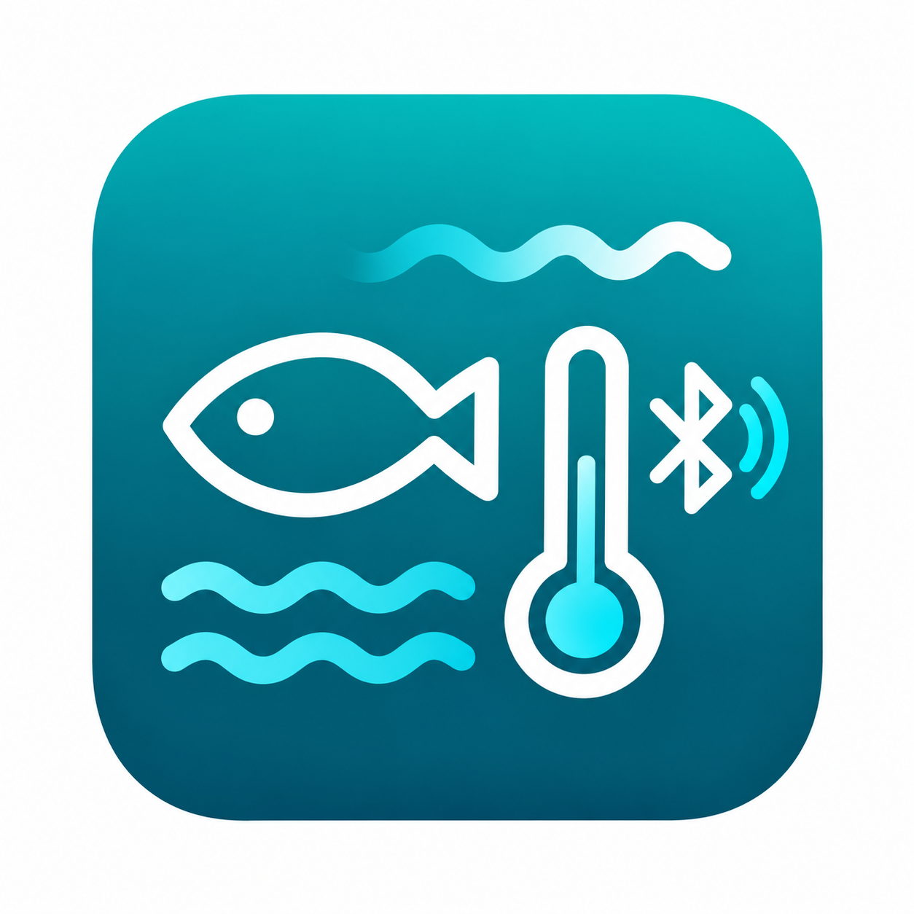

# Aquael BT for Home Assistant

**Development version: v0.1.4**

[English](#english) · [Deutsch](#deutsch)

---

## English

### Overview

Aquael BT is an experimental Home Assistant custom integration for compatible Aquael Bluetooth aquarium devices. It communicates locally over Bluetooth and does not require a cloud connection.

### Current status

Development version with initial support for **Aquael Flow Heater BT**.

- Local passive Bluetooth communication
- Automatic discovery using the Aquael service-data UUID `0xA0B7`
- Manual setup with a dropdown of currently visible Bluetooth devices
- Device addresses are discovered dynamically and are not hard-coded
- Flow Heater BT identification from Bluetooth advertisement data
- Water temperature sensor
- No cloud dependency
- No device-control commands yet
- Initial ULTRAMAX BT support with device identification and Bluetooth signal-strength sensor

### Setup

A supported device can be added in two ways:

1. Automatic Home Assistant Bluetooth discovery.
2. **Settings → Devices & services → Add integration → Aquael BT**, then select a currently visible supported device.

The Bluetooth address is used only as the unique identifier for the selected physical device.

### Reverse-engineered protocol

Observed Flow Heater BT service-data advertisements indicate:

- bytes 0–1: `41 51` (`AQ`)
- bytes 4–9: Bluetooth device address
- byte 10: device type (`0x04` observed for Flow Heater BT)
- bytes 16–17: little-endian temperature in 1/100 °C (working hypothesis)

Example: `24 0A` → `0x0A24` → 2596 → **25.96 °C**.

The decoder applies plausibility checks. Protocol details are based on reverse engineering and may change as additional devices and firmware versions are tested.

### Installation

Install this repository as a custom HACS integration and restart Home Assistant.

### Disclaimer

This is an independent community project based on reverse engineering. It is not affiliated with, sponsored by, or endorsed by Aquael.

---

## Deutsch

### Übersicht

Aquael BT ist eine experimentelle Home-Assistant-Custom-Integration für kompatible Aquael-Bluetooth-Aquariengeräte. Die Kommunikation erfolgt lokal über Bluetooth und benötigt keine Cloud-Verbindung.

### Aktueller Stand

Entwicklungsversion mit erster Unterstützung für den **Aquael Flow Heater BT**.

- Lokale passive Bluetooth-Kommunikation
- Automatische Erkennung über die Aquael-Service-Data-UUID `0xA0B7`
- Manuelle Einrichtung mit Auswahl aktuell sichtbarer Bluetooth-Geräte
- Geräteadressen werden dynamisch erkannt und sind nicht fest einprogrammiert
- Erkennung des Flow Heater BT anhand der Bluetooth-Advertisement-Daten
- Sensor für die Wassertemperatur
- Keine Cloud-Abhängigkeit
- Noch keine Steuerbefehle an die Geräte
- Erste ULTRAMAX-BT-Unterstützung mit Geräteerkennung und Bluetooth-Signalstärke-Sensor

### Einrichtung

Ein unterstütztes Gerät kann auf zwei Wegen hinzugefügt werden:

1. Automatisch über die Bluetooth-Erkennung von Home Assistant.
2. **Einstellungen → Geräte & Dienste → Integration hinzufügen → Aquael BT** und anschließend ein aktuell sichtbares unterstütztes Gerät auswählen.

Die Bluetooth-Adresse wird ausschließlich als eindeutige Kennung des ausgewählten physischen Geräts verwendet.

### Reverse Engineering des Protokolls

Beobachtete Service-Data-Advertisements des Flow Heater BT deuten auf folgende Struktur hin:

- Bytes 0–1: `41 51` (`AQ`)
- Bytes 4–9: Bluetooth-Geräteadresse
- Byte 10: Gerätetyp (`0x04` beim Flow Heater BT beobachtet)
- Bytes 16–17: Little-Endian-Temperatur in 1/100 °C (Arbeitshypothese)

Beispiel: `24 0A` → `0x0A24` → 2596 → **25,96 °C**.

Der Decoder führt Plausibilitätsprüfungen durch. Die Protokolldetails basieren auf Reverse Engineering und können sich mit weiteren getesteten Geräten und Firmware-Versionen ändern.

### Installation

Dieses Repository als benutzerdefinierte HACS-Integration installieren und Home Assistant anschließend neu starten.

### Hinweis

Dies ist ein unabhängiges Community-Projekt auf Basis von Reverse Engineering. Es besteht keine Verbindung, Partnerschaft oder offizielle Unterstützung durch Aquael.
